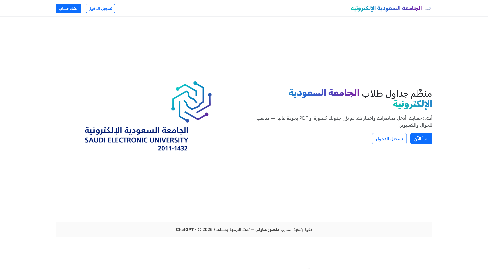
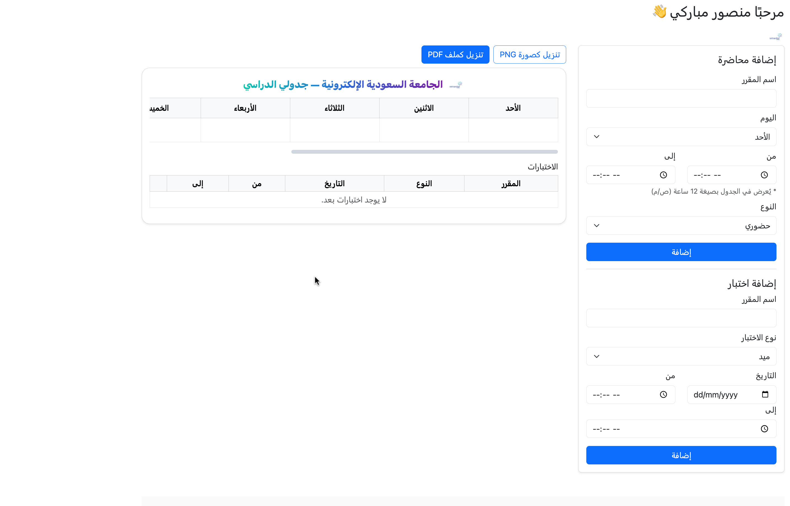
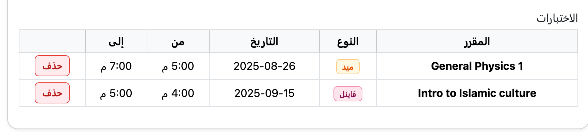
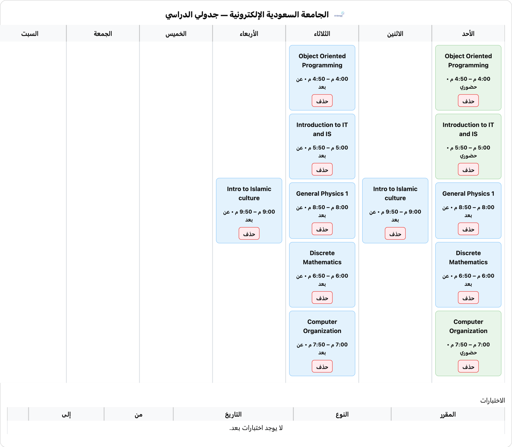

# 🎓 SEU Scheduler – جدولي الدراسي

مشروع ويب متكامل يساعد طلاب **الجامعة السعودية الإلكترونية** على تنظيم **المحاضرات والاختبارات** بسهولة مع إمكانية **التصدير كصورة PNG أو ملف PDF** بشكل أنيق واحترافي.  

---

## ✨ المميزات
- 📚 **إدارة المحاضرات**: إضافة، عرض، وحذف (حضوري / عن بعد).  
- 📝 **إدارة الاختبارات**: ميد / فاينل مع التاريخ والوقت.  
- 🎨 **تصميم احترافي وملون**:
  - 🟢 حضوري.
  - 🔵 عن بعد.
  - 🟡 ميد.
  - 🔴 فاينل.  
- 📤 **تصدير الجدول**:
  - تنزيل كصورة PNG.
  - تنزيل كملف PDF.
- 📱 **واجهة متجاوبة** تعمل على جميع الأجهزة.  
- 🌐 **دعم كامل للغة العربية**.  

---

## ⚙️ المتطلبات
- Python 3.9 أو أحدث  
- مكتبات موجودة في `requirements.txt`:
  - Flask  
  - SQLAlchemy  
  - Jinja2  
  - Werkzeug  

---

## 🚀 طريقة التشغيل محليًا
```bash
# 1. استنساخ المشروع
git clone https://github.com/YOUR_USERNAME/seu-scheduler.git
cd seu-scheduler

# 2. إنشاء بيئة افتراضية
python -m venv venv
source venv/bin/activate   # macOS/Linux
venv\Scripts\activate      # Windows

# 3. تثبيت المتطلبات
pip install -r requirements.txt

# 4. تشغيل التطبيق
flask run
# أو
python app.py
```

📌 افتح المتصفح على:  
```
http://127.0.0.1:5000
```

---

## 🐳 النشر على Fly.io
المشروع جاهز للنشر على **Fly.io**:  
```bash
fly launch
fly deploy
```

---

## 📸 لقطات من المشروع
| الصفحة الرئيسية | واجهة المستخدم | شاشة الاختبارات | شاشة الجدول |
|-----------------|----------------|-----------------|--------------|
|  |  |  |  |

---

## 👨‍🎓 عن المشروع
تم تطوير هذا المشروع بواسطة:  
**مـنصـور مبـاركـي – Mansour Mubarki**  
أحد طلاب **الجامعة السعودية الإلكترونية** 🇸🇦  

---

## 📜 الترخيص
هذا المشروع مفتوح المصدر تحت رخصة **MIT License** – متاح للتطوير والتحسين.
